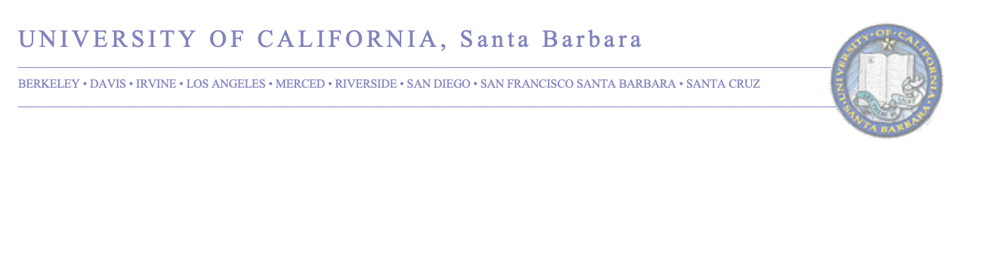

```{r setup, include=FALSE}
source("../global.R")
form = "Cover Letter"
```

<!-- HEADER Section -->


\vspace{-25mm}
\textbf{J. Michael Johnson}
\textcolor{gray}{
\newline jmj00@ucsb.edu $\cdot$ (719) 304-4951
\newline 767 Cypress Walk, Goleta, CA 93117
\newline \textcolor{header_blue}{\textcolor{gray}{\faGlobe} \hspace{0.2mm} \href{https://mikejohnson51.github.io}{https://mikejohnson51.github.io}}
}
\vspace{5mm}
\newline \textbf{Dr. Kamini Singha}
\textcolor{gray}{
\newline Chair of the Search Committee
\newline Colorado School of Mines, 1500 Illinois St, Golden, CO 80401
}
\vspace{5mm}

Dear Dr. Singha,

I am writing to apply for an Assistant Professor position in the Computational Science and Data Analytics cluster hire (Job no. 494587) at the Colorado School of Mines. I will earn my PhD in Geography in March 2021 from the University of California, Santa Barbara (UCSB).

For this call, my preferred home departments would be _Civil & Environmental Engineering_ or _Geology & Geological Engineering_, and I would be eager to support both the Hydrologic Science and Engineering (HSE) and GIS and Geoinformatics Interdisciplinary Programs. I am most interested in the Computational Hydrology focus area but my research and teaching involves many aspects of spatial and statistical data science methods, applied machine learning, computer science technologies, hydrologic and land surface modeling, and software development.

Concurrent to my PhD studies, I am a NOAA Affiliate (Water Resource Engineer II through Lynker Technologies in Boulder, Colorado) assigned to support the National Water Center and their next generation water model efforts. Additionally, I am working as a primary data scientist for the Urban Flooding Open Knowledge Network which is a large-scale NSF-funded project building semantic technologies to integrate geodata with continental and local scale hydrologic models with principal investigators at University of Cincinnati, North Carolina State University, University of Illinois at Urban Champagne, Purdue University, Woods Hole Oceanographic Institution, and University of Maine. Additionally, I sit on an Advisory Board for Azevea which is supported by a NOAA small business grant to build systems for disseminating model output from continental land surface and hydrologic models.

As a graduate student, I have published ten papers with three currently in revisions/review (eight of the thirteen are first author) with UCSB undergraduates, domestic and international students and faculty, and researchers at the USGS, NOAA, and NCAR. I have written grants totaling $65,000, found external fellowships totaling $40,000, and helped author an NSF proposal worth $2,853,561. Through these experiences I have learned about the process of funding research through small and large solicitations and, if offered a position at Mines, will continue actively establishing a self-funded, diverse research group, that recruits and involves undergraduate and graduate students.

I am particularly excited about the opportunity to teach at a university like Mines that embraces a learn by doing philosophy, devotes significant time and resources to educating students, has an established tradition of faculty and students working together.

At UCSB, I designed a data science focused, _Introduction to Geoinformatics_ course which is in process of being adopted as a new  Geography prerequisite both for the undergraduates and the newly established Masters in GIS. I taught this course remotely in the summer of 2020 and am scheduled to teach it as a lecturer this coming summer in person. Additionally, I have TA’d for 10 different classes (seventeen quarters) including remote sensing, GIS, software engineering, and data visualization.

Related to this call, I would be eager to develop and teach materials geared towards the study of earth, energy and engineering with a data-centric and data-science focus in traditional, hybrid, and online platforms. I would be able to support the modular MS in Data Science programs both by broadly integrating data science best practices and education into the core of STEM training and graduate certificates, and specifically in the domain of geospatial applications, including GIS, geoinformatics, geostatistics, and remote sensing. Equally I would bring my hydrologic and land surface modeling experience to support the HSE’s research agenda and help grow graduate offerings related to local, regional, and continental scale water modeling, analysis, and evaluation.  

On a more personal note, I grew up in Colorado and the combination of the aim of this call and Mines as a university, is a perfect opportunity for me to do what I love, surrounded by a community equally dedicated to research teaching, in the place I’ve always called home. Therefore, I could not be more excited to apply. 

The enclosed material details specifically how I hope to contribute to your department(s) and the exciting interdisciplinary work being done at Mines. 

Thank you for your consideration, 

\vspace{3mm}

{width=200px}

\textbf{Mike Johnson}
\footnotesize

PhD Candidate

\textcolor{gray}{Department of Geography, University of California, Santa Barbara} 

\textcolor{header_blue}{\textcolor{gray}{\faGlobe} \hspace{0.2mm} \href{https://mikejohnson51.github.io}{https://mikejohnson51.github.io}} $\cdot$ 
            \textcolor{gray}{\faEnvelope} \hspace{0.2mm} jmj00@ucsb.edu $\cdot$ 
            \textcolor{header_blue}{\textcolor{gray}{\faGithub} \hspace{0.2mm} \href{https://github.com/mikejohnson51}{https://github.com/mikejohnson51}}
